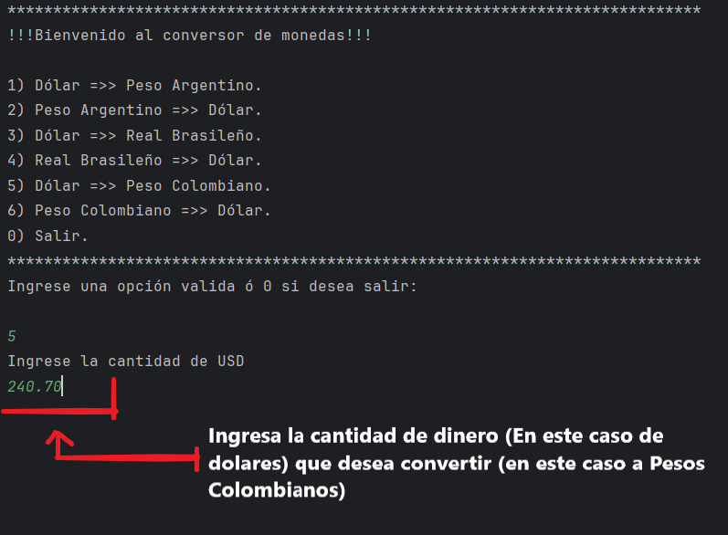
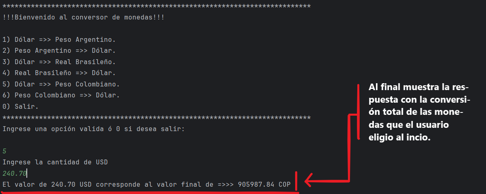

<h1>Conversor de monedas internacionales</h1>

Este programa funciona como un conversor de monedas, si usted desea saber 
por ejemplo cuanto son $200.00 dólares (USD) en Reales Brasileños (BRL) este
programa es capas de hacer una conversión exacta gracias a que se implemento
la API de ExchangeRate. Gracias por su preferencia.

<h2>Como puedo usar este programa?</h2>

Imagen 1: En la siguiente imagen se logra ver el menú principal que él
sistema muestra al correrlo, mostrando un mensaje de bienvenida y a conti-
nuación 7 opciones para escoger, siendo las primeras 6 enumeradas del 1 al 6
las opciones de conversión que entrega el sistema y siendo la última enumerada
con 0 para salir y cerrar el sistema. Luego se muestra un campo en donde el 
usuario debe de ingresar la opción que él desea.

Imagen 2: En esta segunda captura, el programa después de que él usuario
ingresara la opción deseada, muestra un texto en donde pide ingresar la cantidad
de dinero que desea convertir a Pesos Colombianos (Según el ejemplo en las cap-
turas, dado que en la captura se muestra que el usuario selecciono la opción 
número 5).

Imagen 3: En la siguiente y ultima captura, se muestra la respuesta del
programa después de ingresar la cantidad de dinero a convertir, la respuesta
se personaliza dependiendo de la opción que el usuario elija al principio y
de la cantidad de dinero que ingrese.

<h2>Te agradecemos mucho por el apoyo!</h2>

Esperamos seguir mejorando y estamos abiertos a comentarios y sugerencias
para mejorarlo y a posibles actualizaciones para poder integrar más opciones
al sistema.
